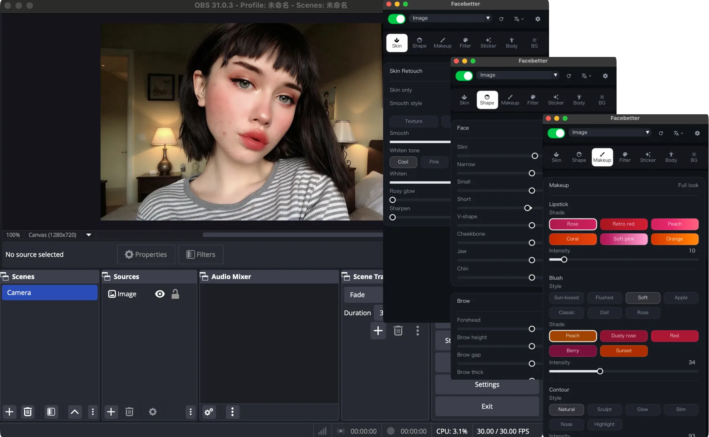

<h1 align="center">
  
</h1>

  <a href="./README.md">English</a> |
  <a href="./README_CN.md">简体中文</a>

  <a href="https://facebetter.net/obs" target="_blank">Website</a>
   · 
  <a href="https://github.com/pixpark/facebetter-obs-plugin/releases" target="_blank">Download</a>

  

## Introduction

A real-time beauty filter for [OBS Studio](https://obsproject.com/). Skin, reshape, makeup, body, LUT filters, stickers, and virtual background run on your machine and go out with the stream.

This repository publishes the installers. Source code is not included.

| | |
| --- | --- |
| macOS | 13 or later, Intel and Apple silicon |
| Windows | 10 / 11, 64-bit |
| OBS Studio | 28 or later, 64-bit |

The panel follows the language you set in OBS: Simplified Chinese, Traditional Chinese, English, Japanese, Korean, Portuguese, Spanish, and German. Other OBS languages use English.

## Download

On the latest [Release](https://github.com/pixpark/facebetter-obs-plugin/releases/latest):

| File | Platform |
| --- | --- |
| `facebetter-obs-macos-latest.zip` | macOS, Intel and Apple silicon |
| `facebetter-obs-windows-latest.zip` | Windows x64 |

Quit OBS completely before you install, including its menu-bar item.

## macOS

1. Unzip the download.
2. Open `Facebetter-OBS-*-macos-universal.pkg`.
3. Open OBS.

The plugin is installed for the current user only:

`~/Library/Application Support/obs-studio/plugins/facebetter.plugin`

The package is not notarized by Apple. macOS may show **“could not be opened”** and offer **Move to Trash**. Do not move it to the Trash.

1. Open **System Settings → Privacy & Security**.
2. Next to the blocked Facebetter installer, click **Open Anyway**.
3. Confirm **Open**.

## Windows

1. Unzip the download.
2. Copy the whole `obs-facebetter` folder to:

   `C:\ProgramData\obs-studio\plugins\`

   The plugin DLL is `C:\ProgramData\obs-studio\plugins\obs-facebetter\bin\64bit\obs-facebetter.dll`. Leave `facebetter.dll` beside it.

3. Open OBS.

`ProgramData` is hidden. In File Explorer, turn on **View → Show → Hidden items**. If Windows asks for permission while copying, allow it. Scenes and logs live in `%APPDATA%\obs-studio\`. The plugin does not go there.

## Use

1. Right-click the source you want to process (camera, window capture, media, or another source).
2. Open **Filters → + → Facebetter Beauty**.
3. Sign in from the panel. The browser finishes login or sign-up, then you return to OBS.

Close the panel any time. Open it again from **Tools → Facebetter**.

Processing stays on this computer. Frames are not uploaded.

The free plan includes every effect. Output carries a watermark. A subscription removes the watermark. Plans are on the [product page](https://facebetter.net/obs#pricing).

## Support

Install trouble or account questions: [hello@facebetter.net](mailto:hello@facebetter.net)
